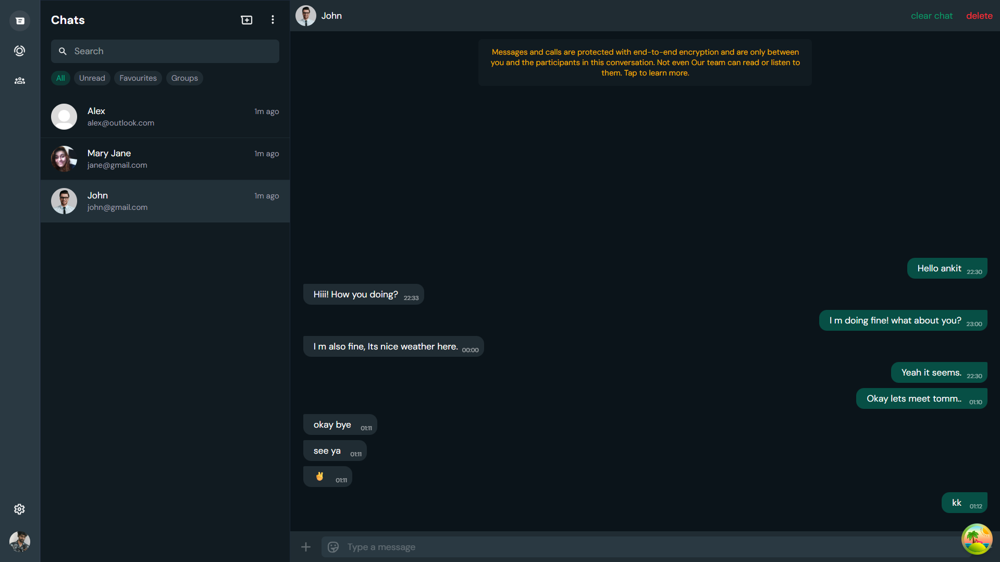

# Fullstack WhatsApp Clone

A modern, full stack WhatsApp clone built with the latest web technologies. This project demonstrates advanced skills in frontend and backend development, real-time communication, authentication, and scalable architecture.



---

## 🚀 Features

- **Real-Time Messaging:**  
  Instant, bidirectional chat using Socket.IO for seamless real-time communication.

- **Authentication & Authorization:**  
  Secure login system with session management and protected routes.

- **User Profiles:**  
  View and edit user profiles, including avatars and personal information.

- **Contact Management:**  
  Browse, search, and start chats with contacts. Initiate new conversations easily.

- **Chat List & Chat Window:**  
  Responsive chat list with unread indicators, chat previews, and detailed chat windows.

- **Responsive UI:**  
  Desktop-first, mobile-aware design using Tailwind CSS and custom themes.

- **Settings & Customization:**  
  User settings page for profile and app preferences.

- **Robust State Management:**  
  Zustand for global state, React Query for data fetching and caching.

- **Error Handling & Loading States:**  
  User-friendly feedback for loading, errors, and empty states.

---

## 🛠️ Tech Stack

- **Frontend:**
  - [React 19](https://react.dev/) (with TypeScript)
  - [Vite](https://vitejs.dev/) (blazing fast dev/build)
  - [Tailwind CSS 4](https://tailwindcss.com/) (utility-first styling)
  - [Zustand](https://zustand-demo.pmnd.rs/) (state management)
  - [React Query](https://tanstack.com/query/latest) (server state/data fetching)
  - [React Router 7](https://reactrouter.com/) (routing)
  - [Socket.IO Client](https://socket.io/) (real-time communication)
  - [Axios](https://axios-http.com/) (HTTP requests)

- **Backend:**  
  *(Not included in this repo, but designed for Node.js/Express, MongoDB, Socket.IO, JWT, etc.)*

- **Tooling:**
  - [TypeScript](https://www.typescriptlang.org/) (type safety)
  - [ESLint](https://eslint.org/) (linting)
  - [Vite](https://vitejs.dev/) (build/dev server)
  - [React Query Devtools](https://tanstack.com/query/latest/docs/devtools) (debugging)

---

## 📸 Screenshots

<!-- Add more screenshots as needed -->


---

## 💡 Why This Project?

This project is designed to showcase:

- **Full Stack Proficiency:**  
  End-to-end implementation of a real-world, production-grade chat app.

- **Modern React Patterns:**  
  Hooks, context, modular components, and best practices.

- **Real-Time Systems:**  
  Socket.IO integration for live updates and messaging.

- **Scalable Architecture:**  
  Separation of concerns, reusable layouts, and maintainable codebase.

- **UI/UX Excellence:**  
  Clean, modern, and accessible interface inspired by WhatsApp Web.

---

## 🏗️ Getting Started

1. **Install dependencies:**
   ```bash
   npm install
   ```

2. **Start the development server:**
   ```bash
   npm run dev
   ```

3. **Configure the backend:**  
   Ensure your backend server (Node.js/Express, MongoDB, Socket.IO) is running and accessible at the configured endpoints.

---

## 📂 Project Structure

- `src/components/` – Reusable UI components (ChatList, ChatWindow, Profile, etc.)
- `src/layouts/` – Layout components for different app sections
- `src/store/` – Zustand stores for global state
- `src/` – Main entry, routes, and styles

---

## 🙋‍♂️ Who Should Check This Out?

- Full stack web developer employers seeking candidates with:
  - Modern React/TypeScript skills
  - Real-time app experience
  - Strong UI/UX sensibilities
  - Experience with scalable, maintainable codebases

---

## 📧 Contact

Interested in collaborating or hiring?  
Feel free to reach out via [LinkedIn](#) or email!

---